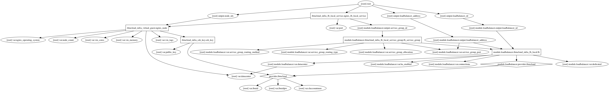

# Load Balanced Web Servers

A Terraform configuration template to deploy an IBM Cloud load balancer (as a service) and _N_ number of web servers.

This template will create the following resources:

- _N_ (default 2) Virtual Guests acting as Web Servers
- An IBM Cloud LBaaS
- _N_ (default 2) An IBM Cloud LBaaS Service definitions

# Architecture

```
                         HTTP Requests
                               +
                               |
                               |
                               |
                               |
                               |
           +-------------------v-------------------+
           |                                       |
           |                                       |
           |         Load Balancer                 |
           |                                       |
           |                                       |
       +---+-----------------+---------------------+---+
       |                     |                         |
       |                     |                         |
       |                     |                         |
+------v-------+     +-------v------+    +-------------v--+
|              |     |              |    | +----------------+
|              |     |              |    | | +----------------+
|              |     |              |    | | | +-----------------+
|  Web Server  |     |  Web Server  |    | | | |           | | | |
|              |     |              |    | | | | Web Server| | | |
|              |     |              |    | | | |           | | | |
|              |     |              |    | | | |           | | | |
+--------------+     +--------------+    +-----------------+ | | |
                                           +-----------------+ | |
                                             +-----------------+ |
                                              +------------------+
                                               N # of servers
```

# Usage

This is not a module, it is a terraform configuration template that can be cloned to be used. A module is used in this template for creating the load balancer and load balancer service group; it can be found at https://github.com/ckelner/tf_ibmcloud_local_loadbalancer/tree/v1.1.

Variables can be defined or overwritten using `terraform.tfvars`. Currently `node_count` and `public_key` are being defined and overwritten.

Available IBM Cloud data centers are listed in the section below and can be changed from the default `dal06` by overwriting the default in `terraform.tfvars` using `datacenter = <new-value>`.

You will need to [Setup up IBM Cloud provider credentials](#setting-up-provider-credentials), please see the section titled "[Setting up Provider Credentials](#setting-up-provider-credentials)" for help.

To run this project execute the following steps:

- Change the `public_key` variable value in `terraform.tfvars` to some public key material of your own.
- `terraform get`: this will get all referenced modules
- `terraform plan`: this will perform a dry run to show what infrastructure terraform intends to create
- `terraform apply`: this will create actual infrastructure
  - Infrastructure can be seen in IBM Bluemix under the following URLs:
    - Virtual Guests: https://control.bluemix.net/devices
    - Load Balancers: https://control.bluemix.net/network/loadbalancing/local
    - SSH keys: https://control.bluemix.net/devices/sshkeys
- `terraform destroy`: this will destroy all infrastructure which has been created

# Available Data Centers
- ams01 : Amsterdam 1
- ams03 : Amsterdam 3
- che01 : Chennai 1
- dal01 : Dallas 1
- dal10 : Dallas 10
- dal12 : Dallas 12
- dal02 : Dallas 2
- dal05 : Dallas 5
- dal06 : Dallas 6
- dal07 : Dallas 7
- dal09 : Dallas 9
- fra02 : Frankfurt 2
- hkg02 : Hong Kong 2
- hou02 : Houston 2
- lon02 : London 2
- mel01 : Melbourne 1
- mex01 : Mexico 1
- mil01 : Milan 1
- mon01 : Montreal 1
- osl01 : Oslo 1
- par01 : Paris 1
- sjc01 : San Jose 1
- sjc03 : San Jose 3
- sao01 : Sao Paulo 1
- sea01 : Seattle 1
- seo01 : Seoul 1
- sng01 : Singapore 1
- syd01 : Sydney 1
- syd04 : Sydney 4
- tok02 : Tokyo 2
- tor01 : Toronto 1
- wdc01 : Washington 1
- wdc04 : Washington 4

# Dependency Graph



# Setting up Provider Credentials

To setup the IBM Cloud provider to work with this example there are a few options for managing credentials safely; here we'll cover the preferred method using environment variables. Other methods can be used, please see the [Terraform Getting Started Variable documentation](https://www.terraform.io/intro/getting-started/variables.html) for further details.

## Environment Variables using IBMid credentials

You'll need to export the following environment variables:

- `TF_VAR_ibmid` - your IBMid login
- `TF_VAR_ibmidpw` - your IBMid password
- `TF_VAR_slaccountnum` - the target softlayer account number (while optional, it is REQUIRED if you have multiple accounts associated with your ID; otherwise you will recieve an error similar to `* ibmcloud_infra_virtual_guest.debian_small_virtual_guest: Error ordering virtual guest: SoftLayer_Exception_Public: You do not have permission to verify server orders. (HTTP 500)`)

On OS X this is achieved by entering the following into your terminal, replacing the `<value>` characters with the actual values (remove the `<>`:

- `export TF_VAR_ibmid=<value>`
- `export TF_VAR_ibmidpw=<value>`
- `export TF_VAR_slaccountnum=<value>`

However this is only temporary to your current terminal session, to make this permanent add these export statements to your `~/.profile`, `~/.bashrc`, `~/.bash_profile` or preferred terminal configuration file. If you go this route without running `export ...` in your command prompt, you'll need to source your terminal configuration file from the command prompt like so: `source ~/.bashrc` (or your preferred config file).

### IBMid Credentials

If you happen to get the error `provider.ibmcloud: Client request to fetch IMS token failed with response code 401` you are likely passing the wrong credentials for IBMid (this is different than IBM w3id).

One way to be certain if your credentials are good or not is to test them with the `test-credentials.sh` script in this repo.  Simply execute the following:

```
bash test-credentials.sh <ibmid> <password> <account-number>
```

Replacing `<ibmid>`, `<password>`, and `<account-number>` for real values.  Where `<account-number>` is your Softlayer account number, which can found at https://control.bluemix.net/account/user/profile under the "API Access Information" section prepended to your "API Username" (or in the upper right it is displayed as part of your account information in parenthesis).

Alternatively you can run the following command:

```bash
curl -s -u 'bx:bx' -k -X POST --header \
'Content-Type: application/x-www-form-urlencoded' \
--header 'Accept: application/json' -d \ "grant_type=password&response_type=cloud_iam,ims_portal \
&username=${1}&password=${2}&ims_account=${3}" https://iam.ng.bluemix.net/oidc/token
```

Replacing `${1}` with your IBMid, `${2}` with your IBMid password, and `${3}` with you Softlayer account number.

When you run either of the above methods, a successful response (meaning the credentials are good) looks like (trimmed for brevity):

```json
{
   "access_token":"eyJraWQiOiIyMDE…a72w",
   "refresh_token":"BTJ8…KLaBJ",
   "ims_token":"e56350224c...1d3d3",
   "ims_user_id":6525897,
   "token_type":"Bearer",
   "expires_in":3600,
   "expiration":1489623909
}
```

And if your credentials are wrong, you will get a different response:

```json
{
   "errorCode":"BXNIM0602E",
   "errorMessage":"The credentials you provided are incorrect",
   "errorDetails":"The credentials you entered for the user 'ckelner@us.ibm.com' are incorrect",
   "context":{
      "requestId":"2512082279",
      "requestType":"incoming.OIDC_Token",
      "startTime":"15.03.2017 22:50:39:925 UTC",
      "endTime":"15.03.2017 22:50:40:224 UTC",
      "elapsedTime":"299",
      "instanceId":"tokenservice/1",
      "host":"localhost",
      "threadId":"8791",
      "clientIp":"73.82.211.28",
      "userAgent":"curl/7.43.0",
      "locale":"en_US"
   }
}
```

If you run into this error, you should reset your IBMid password by navigating to https://www.ibm.com/account/profile/us and clicking on "Reset password"

# Video

A simple video showing Terraform execution of this template: https://www.youtube.com/embed/vTKeWTfalTU
